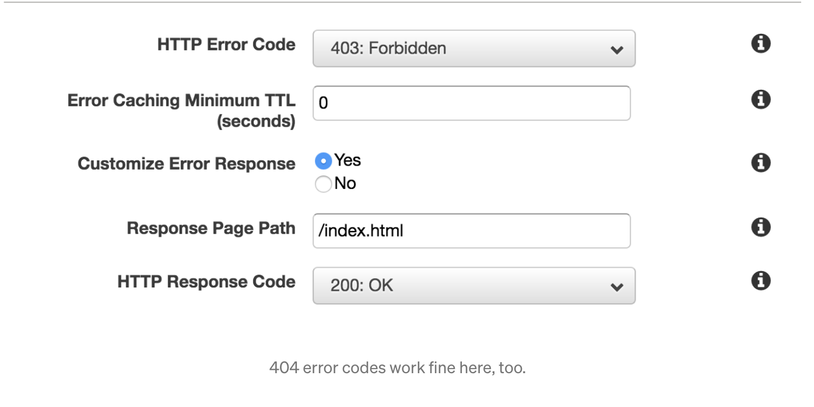

# Deploying a static React Application using AWS S3 and CloudFront

When we do not have API calls or any other server side rendering going on with our application, we can prefer this method. This method of deploying an application would be highly cost effective and faster. The latency is well handled by the CDN service AWS CloudFront

## Steps

### Create an AWS S3 bucket
* Navigate to AWS S3 and click on `Create Bucket` button.
* Allow public access as this wouldn't be a file storage bucket, but a static website hosting.

### Enable static website hosting
* Click on the bucket which we have created.
* Open the `Permissions` tab and scroll to the bottom to enable `Static Website Hosting`

### Configure permissions
* On the permissions tab, include the following policy:
```
{
    "Version": "2012-10-17",
    "Statement": [
        {
            "Sid": "PublicRead",
            "Effect": "Allow",
            "Principal": "*",
            "Action": [
                "s3:GetObject",
                "s3:GetObjectVersion"
            ],
            "Resource": [
                "arn:aws:s3:::DOC-EXAMPLE-BUCKET/*"
            ]
        }
    ]
}
```
This is in line with the recommendation provided by AWS. Read more about the policy [here](https://docs.aws.amazon.com/AmazonS3/latest/userguide/example-bucket-policies.html#example-bucket-policies-use-case-2).

### Upload the `build` directory
* Click on the `upload` button in the s3 bucket and upload the `dist / build` folder whichever is preferred as per the framework to the bucket.

### Create a distribution in AWS CloudFront
* Click on `Create new distribution` on the CloudFront Tab
* Select the S3 link where we have hosted the React Application
* Set the `Default Root Object` to `index.html`
* Open the `Error pages` tab and add custom error page and add `/index.html` with status code as `200(OK)`




### That's all
And that's all there to it. We can find the domain name under the cloudfront distribution once the deployment is up. If we are in need of adding a domain name to the distribution, we can make use of [AWS Route 53 for the same](https://docs.aws.amazon.com/Route53/latest/DeveloperGuide/routing-to-cloudfront-distribution.html).